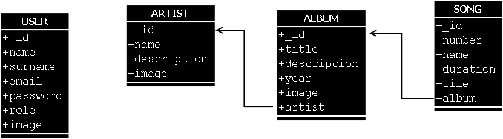

# Desarrollo web con javascript (notas personales)
## Temas Desarrollados

* Entorno de desarrollo
    - Instalacion Node Js
    - Instalar Mongo DB
    - Base de datos
    - Terminal Cywin (Terminal Linux)
    - Crear proyecto
        + npm init
    - Crear alias (comandos personalizados terminal)
* Desarrollo Back-end
    - Instalar dependencias
        + npm **install | i** [package]
    - Diseño de base de datos

    

        
        
 Diseño conceptual para mongoDB.

    

    - Crear base de datos
        + Use **[nameDB]** (Crear DB)
        + db.**[name_collection].save({name:dato})**; (Insertar)
        + db.[name_collection].find(); (Mostrar)
        + db.[name_collection].drop() (Eliminar colección);
        + show dbs; (Mostrar colecciones)
    - Conexión a la base de datos
    - Creacion de la base de datos
    - Usuario
        + Crear modelo
        + Crear controlador
        + Crear registro
        + Crear Login
            - token jwt
            - Middleware
        + Actualizar usuario
        + Avatar
            - Subir imagen
            - Obtener la imagen
