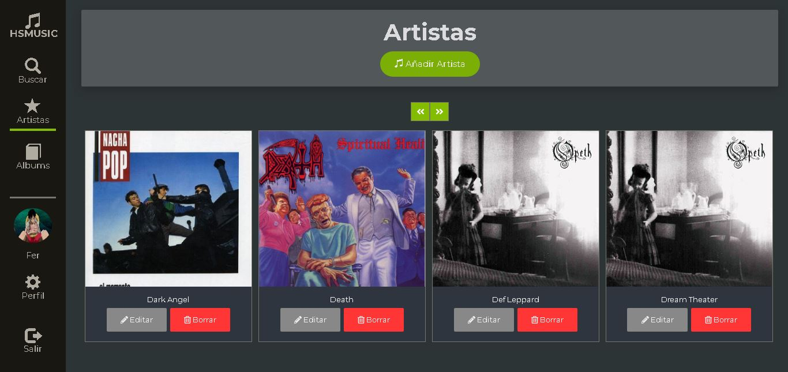

# API REST CON NODE JS

## DESCRIPCION
Web application, similar to spotify using
* ANGULAR
* TYPESCRIPT
* NODEJS
* MONGO DB
* JAVASCRIPT
* BOOSTRAP
* SASS

## SITE

 Site Home user.

## About me
***
  **Author:** Daniel Martinez Sierra

  **Email:** headcruser@gmail.com

  **gitHub:** www.github.com/headcruser

  **linkedin:** Daniel Martinez
